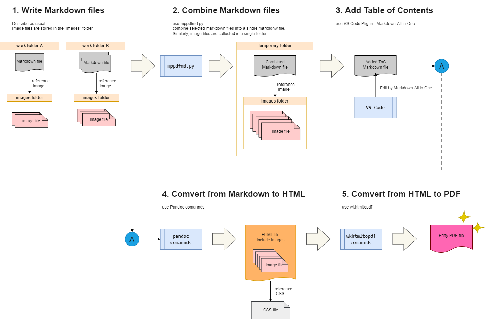

# making-pretty-pdf-from-markdown (mppdfmd)

[for English.](./README_en.md)

## これは何？

複数のMarkdownファイルで書かれたドキュメントを、体裁も考慮した一つのPDFファイルにするツールキットです。

- 体裁とは
  - 表紙や目次、採番付き見出し、コピーライトなどです。

作成されたPDFのサンプルは [こちら](./mppdfmd-kit/_PDF/sample.pdf) にあります。

## 作業イメージ

本ツールキットの作業イメージは下図のようになっています。細かい仕様などの説明は[Qiitaの記事]()としてアップしておきました。



## 想定環境

Windows 10での動作確認済み。

Macでもこのツールキットが使用するツールはあるので基本的には使える想定ですが、ファイルパスなどの表記法の違いからエラーが出るかもしれません。

## License

MIT License, see LICENSE file.

## 使用ツール・使用技術

- Python
- Pandoc
- wkhtmltopdf
- VS Code
- VS Code Plug-in : Markdown All in One
- VS Code Plug-in : markdownlint
- Linux系コマンドが実行可能なターミナル（GitBashなど）

最新版を使用すれば問題ない想定です。

## 動作確認方法（mppdfmd-kit）

- 使用ツールをすべて導入した状態で、`mppdfmd-kit` フォルダの中身一式をローカルにダウンロードしてください。
- `_MD`, `_HTML`, `_PDF` のフォルダの中には、あらかじめ生成結果が格納されています。そのままでも上書きされるだけで問題ありませんが、きれいな状態から結合や変換を確認したい場合は、Markdownファイル、HTMLファイル、PDFファイルおよび、_MDフォルダ内のimagesフォルダを削除してください。
  - **[重要]** `_HTML`フォルダに入っている `github-markdown-light-custom4pdf.css` は消さないでください。
- `mppdfmd.py` を実行してください。（ツールキットでは、サンプル作成用の設定があらかじめ施されています）
  - 実行が成功すると、後続に行う作業の指示やコピペ実行可能なコマンドが表示されます。

``` sh
python mppdfmd.py
```


- `_MD`フォルダの中に、結合されたMarkdownファイルがあることを確認してください。
- 結合したMarkdownファイルをVS Codeで開き、表紙の下部にある `<div class="ToC">` タグの中の★印の説明にある通り、VS Codeプラグイン `Markdown All in One` の 目次生成機能を使用して、`<div>` タグの中にドキュメント全体の目次を生成します。
  - `<div>` タグと生成された目次の間には `１行以上の空行を必ず` 差し込んでください。これは、panoocを使用してMarkdownからHTMLに変換する際に、Markdownの構文を正しく解釈するために必要な措置となります。
  - `markdownlint` プラグインを適用することで、Pandocによる構文解析時におかしな挙動になることを防げます。適切なMarkdown記法で書かれていない場合、意図した体裁でHTMLに変換されないことがあるため、十分注意してください。
- 実行結果の `Markdown to HTML : use the follow command` の指示に続いて表示されるpandocコマンドを実行してください。下に示す例にある ～ディレクトリパス～ は各人の環境により異なります。

``` sh
pandoc ～ディレクトリパス～\\mppdfmd-kit\\_MD//sample.md --to html5 --resource-path _MD\\ --embed-resources --standalone --css _HTML/github-markdown-light-custom4pdf.css --output _HTML//sample.html
```

- `_HTML`フォルダの中に、Markdownから変換されたHTMLファイルがあることを確認してください。
  - この時点で見出しへの自動採番が適用されます。
- 実行結果の `Refactaring HTML ...` の指示に続いて表示されるsedコマンドを実行してください。

``` sh
sed -i -z 's/<\/body>\n<\/html>/<\/div>\n<\/body>\n<\/html>/g' _HTML//sample.html
```

- HTMLファイルの末尾の`</body>`タグの上に、`</div>`タグが挿入されていることを確認してください。
- 実行結果の `HTML to PDF : use the follow command` の指示に続いて表示されるwkhtmltopdfコマンドを実行してください。

``` sh
wkhtmltopdf --footer-left 'copyright hoge hige hanage.' --footer-right '[page]/[topage]' _HTML//sample.html _PDF//sample.pdf
```

- `_PDF`フォルダの中に、HTMLから変換されたPDFファイルがあることを確認してください。

## 使用方法

サンプルの動作確認ではなく、自分のドキュメント作成を行う際の手順を記載します。

### ドキュメント作成のための環境準備～ドキュメント作成

ツールキット（mppdfmd-kitフォルダの中身）を参考に、下記の説明に従ったドキュメント作成用のフォルダを作成します。この準備作業が終わったら、順次ドキュメントの作成を行ってください。

- 結合したMarkdownファイルや、変換したHTMLおよびPDFを格納するフォルダを用意します。
  - _MD
    - 初期状態は、中身は空です。
    - GitHub上では空フォルダは作成できないため、.gitkeepファイルを格納するなどしてください。
  - _HTML
    - ツールキットに同梱されている `github-markdown-light-custom4pdf.css` を格納してください。
  - _PDF
    - 初期状態は、中身は空です。
    - _MDと同様に、.gitkeepファイルを格納するなどしてください。
- ドキュメントの章単位などで分けたフォルダを作成します。
  - md1～md3フォルダはフォルダごとにMarkdownファイルを分けた場合のサンプルです。
  - Markdownファイルを `mppdfmd.py` スクリプトと同じ階層に置いてもかまいません。（参考：CoverAndToC.md, Remark.md）
  - フォルダ名やフォルダ階層に制約はありません。
- Markdownファイルが参照する画像ファイルは、Markdownファイルと同じ階層にimagesというフォルダを作成し、その中に格納します。
- Markdownファイルは、見出しレベル1(`# 見出しタイトル`)から書き出されることを想定しています。
- ドキュメントの表紙ファイルのサンプル(`CoverAndToC.md`)を用意しています。デザインなどは自由に改変してかまいません。
  - 目次はMarkdownファイルを結合したのちに、半自動で作成します。
- Markdownの注釈はHTML化およびPDF化した際にドキュメントの末尾に集約されるため、注釈用のファイル(`Remark.md`)は章タイトルのみを記載した状態となっています。

### Markdownドキュメントの結合準備

Markdownファイルを結合する準備として、`mppdfmd_config.yaml` の中を編集します。

- merged-file-name
  - 複数のMarkdownファイルを1つに結合したときのファイル名です。
  - PDFファイルの名称にも使用されます。
- copyright
  - PDFのフッターに記載する著作権表示の文言です。
- md-files
  - 結合対象とするMarkdownファイルのリストです。
  - リストに記載された順番に結合されます。

### Markdownドキュメントの結合～HTML化～PDF化

先に説明した [動作確認方法](#動作確認方法mppdfmd-kit) の手順に従って実施してください。

## 補足

### HTMLおよびPDFの見た目を微調整したい場合

`github-markdown-light-custom4pdf.css` を編集してください。

このファイルは、GitHubのMarkdownに適用されているCSSを公開されている [リポジトリ](https://github.com/sindresorhus/github-markdown-css) にある `github-markdown-light.css` を元に、PDF化に併せて一部カスタマイズしたものです。（MITライセンス）

カスタマイズ版の本ファイルでは、レイアウトの微調整に加え、ブラウザ固有のCSSが勝手に適用されないようにする（ユーザーエージェントリセット）追記修正や、目次や見出しへの自動採番などが適用されています。具体的な修正内容を知りたい方は、[Qiitaの記事]()をご覧ください。

## 謝辞

- CSSの元ファイル提供
  - @sindresorhus
  - https://github.com/sindresorhus/github-markdown-css
  - MIT License (see LICENSE file)

- CSSを利用した目次や見出しへの自動採番
  - @UKawamura
  - https://qiita.com/UKawamura/items/42f907c88686fb3be4da

- ユーザーエージェントリセットコードの提供
  - http://html5doctor.com/html-5-reset-stylesheet/

- サンプル用テキスト
  - 青空文庫
  - https://www.aozora.gr.jp/

- サンプル画像
  - 画像自動生成AIサービス：DREAM by WOMBO
  - https://dream.ai/

本当に助かりました。ありがとうございます。
