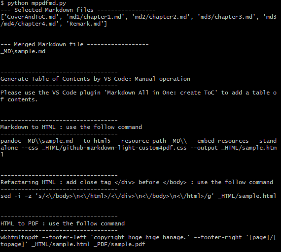

# making-pretty-pdf-from-markdown (mppdfmd)

## What is this ?

This is a toolkit that converts documents written in multiple Markdown files into a single PDF file that also takes into account presentation.

- What is presentation ?
  - cover page, table of contents, numbered headings, and copyright.

A sample of the PDF created can be found [here](./mppdfmd-kit/_PDF/sample.pdf).

## Operation image

The working image of this toolkit is shown in the figure below.

The rough flow of PDF creation is shown below.

1. create a Markdown file
2. merge Markdown files into one
3. add a table of contents to the combined Markdown file
4. convert Markdown with table of contents to HTML using `Pandoc`
5. convert HTML to PDF using `wkhtmltopdf`.


Shows an image of the finished product.


## Assumed environment

Tested on Windows 10.

It is basically assumed that the tools used by this toolkit can be used on Macs as well, but errors may occur due to differences in file path and other notations.

## License

This software is released under the MIT License, see LICENSE file.

## Tools

- Python
- Pandoc
- wkhtmltopdf
- VS Code
- VS Code Plug-in : Markdown All in One
- VS Code Plug-in : markdownlint
- Terminal capable of executing Linux-based commands（e.g. GitBash）

It is assumed that if the latest version is used, there will be no problem.

## How to check the operation (mppdfmd-kit)

Assuming that the Markdown file has been created, we describe the steps to be performed through steps 2 ~ 5 of the working image diagram.

### Preparation work to check operation

- With all the tools used installed, download the complete contents of the `mppdfmd-kit` folder locally.
  - The toolkit comes preloaded with pre-written Markdown files and other resources to make the samples executable.
- The folders `_MD`, `_HTML`, and `_PDF` contain sample-generated results.If you want to check the merging or conversion from a clean state, delete the Markdown, HTML, and PDF files, as well as the images folder in the _MD folder.
  - **[Important]** Do not delete the `github-markdown-light-custom4pdf.css` in the `_HTML` folder.

### Working Image Step 2 : Combine Markdown files into one

Run `mppdfmd.py`. (The toolkit is preconfigured for sample creation.)

- If the execution is successful, instructions for subsequent tasks and commands that can be copied and pasted are displayed.

``` sh
python mppdfmd.py
```



Make sure you have the combined Markdown file in your `_MD` folder.

### Working Image Step 3 : Adding a table of contents to a single combined Markdown file

Open the combined Markdown file in VS Code and use the VS Code plugin `Markdown All in One` to generate a table of contents for the document Generate a table of contents for the entire document in the `<div>` tag.


- Be sure to insert `one or more blank lines` between the `<div>` tag and the generated ticks. This is necessary to ensure correct interpretation of Markdown syntax when converting from Markdown to HTML using panooc.
- The `markdownlint` plugin can be applied to prevent strange behavior during parsing by Pandoc. Please note that if the text is not written in proper Markdown syntax, it may not be converted to HTML with the intended presentation.

### Working Image Step 4 : Convert Markdown with the table of contents added to HTML using Pandoc

Execute the pandoc command that appears following the `Markdown to HTML : use the follow command` instruction. The `~ directory path ~` in the example below will vary depending on your environment.

``` sh
pandoc ~ directory path ~\\mppdfmd-kit\\_MD//sample.md --to html5 --resource-path _MD\\ --embed-resources --standalone --css _HTML/github-markdown-light-custom4pdf.css --output _HTML//sample.html
```

Make sure you have the HTML files converted from Markdown in your `_HTML` folder.

> At this point, automatic numbering is applied to the headings.

Execute the sed command that follows the instructions for `Refactaring HTML ...` instructions followed by the sed command.
This is an additional process for the div closing tag that needs to be defined at the beginning of the cover file, which is not generated automatically.

``` sh
sed -i -z 's/<\/body>\n<\/html>/<\/div>\n<\/body>\n<\/html>/g' _HTML//sample.html
```

Make sure that the `</div>` tag is inserted above the `</body>` tag at the end of the HTML file.

### Working Image Step 5 : Convert HTML to PDF using wkhtmltopdf

Execute the wkhtmltopdf command that appears following the instruction `HTML to PDF: use the follow command` in the execution result.

``` sh
wkhtmltopdf --footer-left 'copyright hoge hige hanage.' --footer-right '[page]/[topage]' _HTML//sample.html _PDF//sample.pdf
```

Make sure you have the converted PDF file from HTML in your ``_PDF`` folder.

## Markdown Documentation Policy

The following is a description of the policy for doing your own documentation under the assumption that you will be using this toolkit.

### Preparation of environment for documentation -> Documentation

Referring to the contents of the toolkit (mppdfmd-kit), create a folder for document creation according to the instructions below. After this preparatory work is completed, please create documents sequentially.

- Prepare a folder to store the combined Markdown files and the converted HTML and PDF files.
  - `_MD` folder
    - Initially, the contents are empty.
    - Since an empty folder cannot be created on GitHub, please store a .gitkeep file, for example.
  - `_HTML` folder
    - Store the `github-markdown-light-custom4pdf.css` included in the toolkit.
  - `_PDF` folder
    - Initially, the contents are empty.
    - As with _MD, store .gitkeep files, etc.
- Create folders separated by document chapters, etc.
  - The md1, md2, md3 folders are samples of Markdown files separated by folder.
  - You may place the Markdown file on the same level as the `mppdfmd.py` script.（FYI : CoverAndToC.md, Remark.md）
  - There are no restrictions on folder names or folder hierarchies.
- Image files referenced by Markdown files are stored in a folder named images on the same level as the Markdown file.
- Markdown files are assumed to be written from heading level 1 (`# heading title`).
- A sample document cover file (`CoverAndToC.md`) is provided. You may freely modify the design, etc.
  - The table of contents is created semi-automatically after the Markdown files are combined.
- Markdown annotations are consolidated at the end of the document when converted to HTML and PDF, so the file for annotations (`Remark.md`) contains only the chapter title.


### Preparing to merge Markdown documents

In preparation for combining the Markdown files, edit the file `mppdfmd_config.yaml`.

- merged-file-name
  - The name of the file when multiple Markdown files are combined into one.
  - It is also used for PDF file names.
- copyright
  - The text of the copyright notice to be included in the footer of the PDF.
- md-files
  - List of Markdown files to be combined.
  - They are combined in the order in which they are listed.

### Combining Markdown documents ~ converting to HTML ~ converting to PDF

Follow the procedure for [How to check the operation](#how-to-check-the-operation-mppdfmd-kit) described earlier.

## Supplement

### You want to fine-tune the look and feel of your HTML and PDF

Edit `github-markdown-light-custom4pdf.css`.

This file is based on `github-markdown-light.css` in the public [GitHub repository](https://github.com/sindresorhus/github-markdown-css) of CSS applied to Markdown, and is partially customized along with PDF conversion.

In addition to layout tweaks, this customized version of the file applies browser-specific user agent resets and automatic numbering to the table of contents and headings.

## Thanks

- Original CSS files provided
  - @sindresorhus
  - https://github.com/sindresorhus/github-markdown-css
  - MIT License (see LICENSE file)

- Automatic numbering of tables of contents and headings using CSS
  - @UKawamura
  - https://qiita.com/UKawamura/items/42f907c88686fb3be4da

- Provide user agent reset code
  - http://html5doctor.com/html-5-reset-stylesheet/

- Sample Text
  - Aozora Bunko (digital library)
  - https://www.aozora.gr.jp/

- Sample Images
  - DREAM by WOMBO
  - https://dream.ai/

It was really helpful. Thank you very much.
