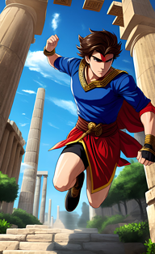

ドキュメントタイトル

サブタイトル

作成日時 
作成者

改訂履歴

|版   | 改定内容                 |作成・更新日 |作成・更新者|
|:---:|:------------------------|:-----      |:-----     |
|1.0  |初版                     |yyyMMdd      |〇〇〇     |

目次

★Markdownファイルを結合したのち、この行の場所にVS Codeプラグイン `Markdown All in One` の目次生成機能を利用してドキュメント全体に対する目次を作成する。（F1キーでコマンドパレットを表示し、`Markdown All in One: 目次生成` を実行）

# 走れメロス

## 作者

太宰治

## 序文 [^meros]

メロスは激怒した。必ず、かの邪智暴虐の王を除かなければならぬと決意した。メロスには政治がわからぬ。メロスは、村の牧人である。笛を吹き、羊と遊んで暮して来た。けれども邪悪に対しては、人一倍に敏感であった。きょう未明メロスは村を出発し、野を越え山越え、十里はなれた此このシラクスの市にやって来た。メロスには父も、母も無い。女房も無い。十六の、内気な妹と二人暮しだ。この妹は、村の或る律気な一牧人を、近々、花婿として迎える事になっていた。結婚式も間近かなのである。メロスは、それゆえ、花嫁の衣裳やら祝宴の御馳走やらを買いに、はるばる市にやって来たのだ。先ず、その品々を買い集め、それから都の大路をぶらぶら歩いた。メロスには竹馬の友があった。セリヌンティウスである。今は此のシラクスの市で、石工をしている。その友を、これから訪ねてみるつもりなのだ。久しく逢わなかったのだから、訪ねて行くのが楽しみである。歩いているうちにメロスは、まちの様子を怪しく思った。ひっそりしている。もう既に日も落ちて、まちの暗いのは当りまえだが、けれども、なんだか、夜のせいばかりでは無く、市全体が、やけに寂しい。のんきなメロスも、だんだん不安になって来た。路で逢った若い衆をつかまえて、何かあったのか、二年まえに此の市に来たときは、夜でも皆が歌をうたって、まちは賑やかであった筈はずだが、と質問した。若い衆は、首を振って答えなかった。しばらく歩いて老爺に逢い、こんどはもっと、語勢を強くして質問した。老爺は答えなかった。メロスは両手で老爺のからだをゆすぶって質問を重ねた。老爺は、あたりをはばかる低声で、わずか答えた。

[^meros]: 青空文庫：[走れメロス](https://www.aozora.gr.jp/cards/000035/files/1567_14913.html)

# 吾輩は猫である

## 作者

夏目漱石

## 序文 [^neco]

吾輩は猫である。名前はまだ無い。

どこで生れたかとんと見当がつかぬ。何でも薄暗いじめじめした所でニャーニャー泣いていた事だけは記憶している。吾輩はここで始めて人間というものを見た。しかもあとで聞くとそれは書生という人間中で一番獰悪な種族であったそうだ。この書生というのは時々我々を捕まえて煮て食うという話である。しかしその当時は何という考もなかったから別段恐しいとも思わなかった。ただ彼の掌てのひらに載せられてスーと持ち上げられた時何だかフワフワした感じがあったばかりである。掌の上で少し落ちついて書生の顔を見たのがいわゆる人間というものの見始みはじめであろう。この時妙なものだと思った感じが今でも残っている。第一毛をもって装飾されべきはずの顔がつるつるしてまるで薬缶やかんだ。その後ご猫にもだいぶ逢ったがこんな片輪には一度も出会した事がない。のみならず顔の真中があまりに突起している。そうしてその穴の中から時々ぷうぷうと煙けむりを吹く。どうも咽ぽくて実に弱った。これが人間の飲む煙草というものである事はようやくこの頃知った。

[^neco]: 青空文庫：[吾輩は猫である](https://www.aozora.gr.jp/cards/000148/files/789_14547.html)

# 銀河鉄道の夜

## 作者

宮沢賢治

## 序文 [^ginga]

「ではみなさんは、そういうふうに川だと云いわれたり、乳の流れたあとだと云われたりしていたこのぼんやりと白いものがほんとうは何かご承知ですか。」先生は、黒板に吊つるした大きな黒い星座の図の、上から下へ白くけぶった銀河帯のようなところを指さしながら、みんなに問といをかけました。
　カムパネルラが手をあげました。それから四五人手をあげました。ジョバンニも手をあげようとして、急いでそのままやめました。たしかにあれがみんな星だと、いつか雑誌で読んだのでしたが、このごろはジョバンニはまるで毎日教室でもねむく、本を読むひまも読む本もないので、なんだかどんなこともよくわからないという気持ちがするのでした。
　ところが先生は早くもそれを見附みつけたのでした。
「ジョバンニさん。あなたはわかっているのでしょう。」
　ジョバンニは勢いきおいよく立ちあがりましたが、立って見るともうはっきりとそれを答えることができないのでした。ザネリが前の席からふりかえって、ジョバンニを見てくすっとわらいました。ジョバンニはもうどぎまぎしてまっ赤になってしまいました。先生がまた云いました。
「大きな望遠鏡で銀河をよっく調べると銀河は大体何でしょう。」
　やっぱり星だとジョバンニは思いましたがこんどもすぐに答えることができませんでした。
　先生はしばらく困ったようすでしたが、眼めをカムパネルラの方へ向けて、
「ではカムパネルラさん。」と名指しました。するとあんなに元気に手をあげたカムパネルラが、やはりもじもじ立ち上ったままやはり答えができませんでした。
　先生は意外なようにしばらくじっとカムパネルラを見ていましたが、急いで「では。よし。」と云いながら、自分で星図を指さしました。

[^ginga]: 青空文庫：[銀河鉄道の夜](https://www.aozora.gr.jp/cards/000081/files/456_15050.html)

# 藪の中

## 作者

芥川龍之介

## 序文 [^yabu]

さようでございます。あの死骸を見つけたのは、わたしに違いございません。わたしは今朝いつもの通り、裏山の杉を伐りに参りました。すると山陰の藪の中に、あの死骸があったのでございます。あった処でございますか？　それは山科の駅路からは、四五町ほど隔たって居りましょう。竹の中に痩せ杉の交った、人気のない所でございます。
　死骸は縹の水干に、都風のさび烏帽子をかぶったまま、仰向に倒れて居りました。何しろ一刀とは申すものの、胸もとの突き傷でございますから、死骸のまわりの竹の落葉は、蘇芳に滲みたようでございます。いえ、血はもう流れては居りません。傷口も乾いて居ったようでございます。おまけにそこには、馬蠅が一匹、わたしの足音も聞えないように、べったり食いついて居りましたっけ。
　太刀か何かは見えなかったか？　いえ、何もございません。ただその側の杉の根がたに、縄が一筋落ちて居りました。それから、――そうそう、縄のほかにも櫛が一つございました。死骸のまわりにあったものは、この二つぎりでございます。が、草や竹の落葉は、一面に踏み荒されて居りましたから、きっとあの男は殺される前に、よほど手痛い働きでも致したのに違いございません。何、馬はいなかったか？　あそこは一体馬なぞには、はいれない所でございます。何しろ馬の通う路とは、藪一つ隔たって居りますから。

[^yabu]: 青空文庫：[藪の中](https://www.aozora.gr.jp/cards/000879/files/179_15255.html)

# 注釈
